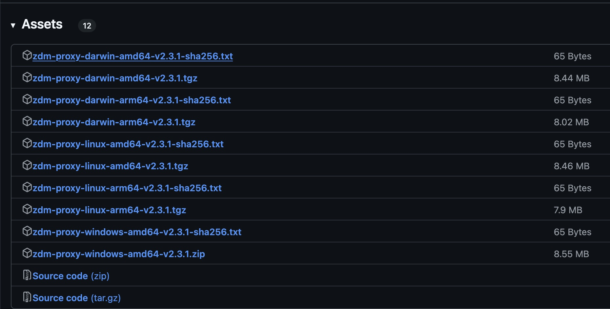

# ZDM Setup

## Requirements

The requirements of installing ZDM to enable dual writes is the following

- Source ScyllaDB/Cassandra Cluster.
- Target ScyllaDB Cluster.
- VM/Docker running ZDM proxy
    - Internet access on the Node
    - Java (ZDM is a java based tool)

## Installation

Following high level steps are involved in the Installation and Configuration of ZDM.

- Create and Configure EC2 Instance
    - Launch an EC2 instance using Ubuntu 20.04 or Amazon Linux 2.
	    - Assign a security group allowing:
	    - Inbound traffic on port 9042 (Cassandra CQL port) from application clients.
	    - Outbound traffic to ScyllaDB clusters (on port 9042).

Connect to the EC2 instance using SSH

```
❯ ssh -i your-key.pem ubuntu@<ZDM_PROXY_EC2_IP>
```

Install JRE 11 as needed by ZDM

```
❯ sudo apt update && sudo apt install -y openjdk-11-jre

❯ java --version
openjdk 11.0.26 2025-01-21
OpenJDK Runtime Environment (build 11.0.26+4-post-Ubuntu-1ubuntu124.04)
OpenJDK 64-Bit Server VM (build 11.0.26+4-post-Ubuntu-1ubuntu124.04, mixed mode, sharing)
```

### Identify the Version

Select the latest build or the build desired from the <https://github.com/datastax/zdm-proxy/tags> by clicking on the tag number "link" In this case we are using `v2.3.1` <https://github.com/datastax/zdm-proxy/releases/tag/v2.3.1>

Scroll down to the **Assets** section and select the correct operating system and hardware architecture such as in ourcase, it's Linux AMD64

  

- <https://github.com/datastax/zdm-proxy/releases/download/v2.3.1/zdm-proxy-linux-amd64-v2.3.1.tgz>

Use `wget` to pull this down to the ZDM EC2 instance.

```
❯ wget https://github.com/datastax/zdm-proxy/releases/download/v2.3.1/zdm-proxy-linux-amd64-v2.3.1.tgz
--2025-02-26 10:32:25--  https://github.com/datastax/zdm-proxy/releases/download/v2.3.1/zdm-proxy-linux-amd64-v2.3.1.tgz
Resolving github.com (github.com)... 20.205.243.166
Connecting to github.com (github.com)|20.205.243.166|:443... connected.
HTTP request sent, awaiting response... 302 Found
...
HTTP request sent, awaiting response... 200 OK
Length: 8870114 (8.5M) [application/octet-stream]
Saving to: ‘zdm-proxy-linux-amd64-v2.3.1.tgz’

zdm-proxy-linux-amd64-v2.3.1.tgz     100%[======================================================================>]   8.46M  27.1MB/s    in 0.3s

2025-02-26 10:32:27 (27.1 MB/s) - ‘zdm-proxy-linux-amd64-v2.3.1.tgz’ saved [8870114/8870114]

❯ ls -lrt
total 8668
-rw-r--r-- 1 root root 8870114 Nov  8 14:27 zdm-proxy-linux-amd64-v2.3.1.tgz
```

Untar the downloaded tar zip file and 

```
❯ tar -zxvf zdm-proxy-linux-amd64-v2.3.1.tgz
zdm-proxy-v2.3.1
LICENSE
```

The extracted `zdm-proxy-v2.3.1` is the executable file. We can move it into the `/usr/local/bin/` as the executable `zdm-proxy` and make this file executable.

```
❯ sudo mv zdm-proxy-v2.3.1 /usr/local/bin/zdm-proxy
❯ sudo chmod +x /usr/local/bin/zdm-proxy
```

Let's verify if the executable works 

```
❯ zdm-proxy --version
ZDM proxy version 2.3.1
```

### Network Verification

Test that ZDM node can connect to all the Scylla nodes on both clusters (source/target) using the CQL port `9042`

```
❯ nc -zv 172.31.7.96 9042
Connection to 172.31.7.96 9042 port [tcp/*] succeeded!

❯ nc -zv 172.31.10.87 9042
Connection to 172.31.10.87 9042 port [tcp/*] succeeded!

❯ nc -zv 172.31.10.104 9042
Connection to 172.31.10.104 9042 port [tcp/*] succeeded!
```

### Setup

Create a config folder `/usr/local/bin/config` followed by creating a new file within `/usr/local/bin/config/zdm_proxy_core_config.yml`

```yaml
---
control_conn_max_protocol_version: "4"

####################################
#### READ ROUTING CONFIGURATION ####
####################################

proxy_max_stream_ids: 4096
proxy_request_timeout_ms: 5000

## Cluster currently considered as "primary" by the ZDM proxy.
## Valid values: ORIGIN (default) or TARGET.
primary_cluster: ORIGIN

## Read handling behavior.
## Valid values: PRIMARY_ONLY (default: read synchronously from primary only)
## and DUAL_ASYNC_ON_SECONDARY (read synchronously from primary, and also asynchronously from secondary).
read_mode: PRIMARY_ONLY

##############################
#### CONNECTION SETTINGS ####
##############################

## ORIGIN CLUSTER (Self-managed Scylla)
origin_contact_points: "172.31.11.11,172.31.4.253,172.31.2.13"
origin_port: 9042

## TARGET CLUSTER (Self-managed Scylla)
target_contact_points: "172.31.7.96,172.31.10.87,172.31.10.104"
target_port: 9042

#################
#### LOGGING ####
#################

## Proxy log level. Defaults to INFO.
log_level: INFO

proxy_listen_address: "0.0.0.0"
```

**Note:** Ensure the firewall is open between the Scylla nodes from both **Target** and **Source** cluster to the ZDM node for the **`9045`** port.

We can now start the ZDM proxy and review the log

```
❯ zdm-proxy -config /usr/local/bin/config/zdm_proxy_core_config.yml

INFO[0000] Starting ZDM proxy version 2.3.1
INFO[0000] Parsed configuration: {"PrimaryCluster":"ORIGIN","ReadMode":"PRIMARY_ONLY","ReplaceCqlFunctions":false,"AsyncHandshakeTimeoutMs":4000,"LogLevel":"INFO","ControlConnMaxProtocolVersion":"4","ProxyTopologyIndex":0,"ProxyTopologyAddresses":"","ProxyTopologyNumTokens":8,"OriginContactPoints":"172.31.11.11,172.31.4.253,172.31.2.13","OriginPort":9042,"OriginSecureConnectBundlePath":"","OriginLocalDatacenter":"","OriginUsername":"","OriginConnectionTimeoutMs":30000,"OriginTlsServerCaPath":"","OriginTlsClientCertPath":"","OriginTlsClientKeyPath":"","TargetContactPoints":"172.31.7.96,172.31.10.87,172.31.10.104","TargetPort":9042,"TargetSecureConnectBundlePath":"","TargetLocalDatacenter":"","TargetUsername":"","TargetConnectionTimeoutMs":30000,"TargetTlsServerCaPath":"","TargetTlsClientCertPath":"","TargetTlsClientKeyPath":"","ProxyListenAddress":"0.0.0.0","ProxyListenPort":14002,"ProxyRequestTimeoutMs":10000,"ProxyMaxClientConnections":1000,"ProxyMaxStreamIds":2048,"ProxyTlsCaPath":"","ProxyTlsCertPath":"","ProxyTlsKeyPath":"","ProxyTlsRequireClientAuth":false,"MetricsEnabled":true,"MetricsAddress":"localhost","MetricsPort":14001,"MetricsPrefix":"zdm","MetricsOriginLatencyBucketsMs":"1, 4, 7, 10, 25, 40, 60, 80, 100, 150, 250, 500, 1000, 2500, 5000, 10000, 15000","MetricsTargetLatencyBucketsMs":"1, 4, 7, 10, 25, 40, 60, 80, 100, 150, 250, 500, 1000, 2500, 5000, 10000, 15000","MetricsAsyncReadLatencyBucketsMs":"1, 4, 7, 10, 25, 40, 60, 80, 100, 150, 250, 500, 1000, 2500, 5000, 10000, 15000","HeartbeatIntervalMs":30000,"HeartbeatRetryIntervalMinMs":250,"HeartbeatRetryIntervalMaxMs":30000,"HeartbeatRetryBackoffFactor":2,"HeartbeatFailureThreshold":1,"SystemQueriesMode":"ORIGIN","ForwardClientCredentialsToOrigin":false,"OriginEnableHostAssignment":true,"TargetEnableHostAssignment":true,"RequestWriteQueueSizeFrames":128,"RequestWriteBufferSizeBytes":4096,"RequestReadBufferSizeBytes":32768,"ResponseWriteQueueSizeFrames":128,"ResponseWriteBufferSizeBytes":8192,"ResponseReadBufferSizeBytes":32768,"RequestResponseMaxWorkers":-1,"WriteMaxWorkers":-1,"ReadMaxWorkers":-1,"ListenerMaxWorkers":-1,"EventQueueSizeFrames":12,"AsyncConnectorWriteQueueSizeFrames":2048,"AsyncConnectorWriteBufferSizeBytes":4096}
INFO[0000] SIGINT/SIGTERM listener started.
INFO[0000] Starting http server (metrics and health checks) on localhost:14001
INFO[0000] Attempting to start the proxy...
INFO[0000] Using 8 request / response workers.
INFO[0000] Using 8 write workers.
INFO[0000] Using 16 read workers.
INFO[0000] Using 2 listener workers.
INFO[0000] Parsed Origin latency buckets: [0.001 0.004 0.007 0.01 0.025 0.04 0.06 0.08 0.1 0.15 0.25 0.5 1 2.5 5 10 15]
INFO[0000] Parsed Target latency buckets: [0.001 0.004 0.007 0.01 0.025 0.04 0.06 0.08 0.1 0.15 0.25 0.5 1 2.5 5 10 15]
INFO[0000] Parsed Async latency buckets: [0.001 0.004 0.007 0.01 0.025 0.04 0.06 0.08 0.1 0.15 0.25 0.5 1 2.5 5 10 15]
INFO[0000] Validating config...
INFO[0000] Proxy TLS was not configured.
INFO[0000] Starting proxy...
INFO[0000] Parsed Topology Config: TopologyConfig{VirtualizationEnabled=true, Addresses=[0.0.0.0], Count=1, Index=0, NumTokens=8}
INFO[0000] Parsed Origin contact points: [172.31.11.11 172.31.4.253 172.31.2.13]
INFO[0000] Parsed Target contact points: [172.31.7.96 172.31.10.87 172.31.10.104]
INFO[0000] TLS was not configured for Origin
INFO[0000] TLS was not configured for Target
INFO[0000] [openTCPConnection] Opening connection to 172.31.11.11:9042
INFO[0000] [openTCPConnection] Successfully established connection with 172.31.11.11:9042
WARN[0000] cqlConn{conn: 172.31.11.11:9042}: expected AUTHENTICATE, got READY – is authentication required?
INFO[0000] Refreshed ORIGIN orderedHostsInLocalDc. Assigned Hosts: [Host{addr: 172.31.2.13, port: 9042, host_id: c0fa119b83614315a1d50e0dd8d0e0d5} Host{addr: 172.31.4.253, port: 9042, host_id: dbecd416456d476fa60d94883701a5f4} Host{addr: 172.31.11.11, port: 9042, host_id: 247151fca06f49c99fedd4351dcdda6f}], VirtualHosts: [VirtualHost{addr: 0.0.0.0, host_id: 6768033e-2164-5824-bbd0-31a0a2d9876d, rack: rack0, tokens: [-9223372036854775808 -6917529027641081856 -4611686018427387904 -2305843009213693952 0 2305843009213693952 4611686018427387904 6917529027641081856], host: Host{addr: 172.31.11.11, port: 9042, host_id: 247151fca06f49c99fedd4351dcdda6f}, partitioner: org.apache.cassandra.dht.Murmur3Partitioner}], ProxyTopologyIndex: 0
INFO[0000] Successfully opened control connection to ORIGIN using endpoint 172.31.11.11:9042 with ProtocolVersion OSS 4.
INFO[0000] [openTCPConnection] Opening connection to 172.31.10.104:9042
INFO[0000] [openTCPConnection] Successfully established connection with 172.31.10.104:9042
WARN[0000] cqlConn{conn: 172.31.10.104:9042}: expected AUTHENTICATE, got READY – is authentication required?
INFO[0000] Refreshed TARGET orderedHostsInLocalDc. Assigned Hosts: [Host{addr: 172.31.7.96, port: 9042, host_id: 20337fb7c9614295bd03fe9f53abd5ed} Host{addr: 172.31.10.104, port: 9042, host_id: a0ac925633874706b66d7497a7d8aa24} Host{addr: 172.31.10.87, port: 9042, host_id: 5a6d8d757b214dd091dce5abfbf6d702}], VirtualHosts: [VirtualHost{addr: 0.0.0.0, host_id: 6768033e-2164-5824-bbd0-31a0a2d9876d, rack: rack0, tokens: [-9223372036854775808 -6917529027641081856 -4611686018427387904 -2305843009213693952 0 2305843009213693952 4611686018427387904 6917529027641081856], host: Host{addr: 172.31.7.96, port: 9042, host_id: 20337fb7c9614295bd03fe9f53abd5ed}, partitioner: org.apache.cassandra.dht.Murmur3Partitioner}], ProxyTopologyIndex: 0
INFO[0000] Successfully opened control connection to TARGET using endpoint 172.31.10.104:9042 with ProtocolVersion OSS 4.
INFO[0000] Initialized origin control connection. Cluster Name: Test Cluster Source, Hosts: map[247151fc-a06f-49c9-9fed-d4351dcdda6f:Host{addr: 172.31.11.11, port: 9042, host_id: 247151fca06f49c99fedd4351dcdda6f} c0fa119b-8361-4315-a1d5-0e0dd8d0e0d5:Host{addr: 172.31.2.13, port: 9042, host_id: c0fa119b83614315a1d50e0dd8d0e0d5} dbecd416-456d-476f-a60d-94883701a5f4:Host{addr: 172.31.4.253, port: 9042, host_id: dbecd416456d476fa60d94883701a5f4}], Assigned Hosts: [Host{addr: 172.31.2.13, port: 9042, host_id: c0fa119b83614315a1d50e0dd8d0e0d5} Host{addr: 172.31.4.253, port: 9042, host_id: dbecd416456d476fa60d94883701a5f4} Host{addr: 172.31.11.11, port: 9042, host_id: 247151fca06f49c99fedd4351dcdda6f}].
INFO[0000] Initialized target control connection. Cluster Name: Test Cluster Target, Hosts: map[20337fb7-c961-4295-bd03-fe9f53abd5ed:Host{addr: 172.31.7.96, port: 9042, host_id: 20337fb7c9614295bd03fe9f53abd5ed} 5a6d8d75-7b21-4dd0-91dc-e5abfbf6d702:Host{addr: 172.31.10.87, port: 9042, host_id: 5a6d8d757b214dd091dce5abfbf6d702} a0ac9256-3387-4706-b66d-7497a7d8aa24:Host{addr: 172.31.10.104, port: 9042, host_id: a0ac925633874706b66d7497a7d8aa24}], Assigned Hosts: [Host{addr: 172.31.7.96, port: 9042, host_id: 20337fb7c9614295bd03fe9f53abd5ed} Host{addr: 172.31.10.104, port: 9042, host_id: a0ac925633874706b66d7497a7d8aa24} Host{addr: 172.31.10.87, port: 9042, host_id: 5a6d8d757b214dd091dce5abfbf6d702}].
INFO[0000] Proxy connected and ready to accept queries on 0.0.0.0:14002
INFO[0000] Proxy started. Waiting for SIGINT/SIGTERM to shutdown.
```

The last line in the log confirms the ZDM is started successfully

```
INFO[0000] Proxy started. Waiting for SIGINT/SIGTERM to shutdown.
```

The ZDM should be started in the background to ensure it keeps running uninterrupted.

```
❯ zdm-proxy -config /usr/local/bin/config/zdm_proxy_core_config.yml > /var/log/zdm-proxy.log 2>&1 &
[1] 5580

❯ jobs
[1]+  Running                 zdm-proxy -config /usr/local/bin/config/zdm_proxy_core_config.yml > /var/log/zdm-proxy.log 2>&1 &
```

The `/var/log/zdm-proxy.log` will contain the ZDM logs for this case. 

### Connect to ZDM

The two clusters that we have are empty and does not contain any data. Let's create a new keyspace and a new table with some data. This action will automatically be done on both clusters using the default `dual writes` method.

Connect to the ZDM on port **`14002`**

```
❯ cqlsh 172.31.40.54 14002
Connected to Test Cluster Source at 172.31.40.54:14002.
[cqlsh 5.0.1 | Cassandra 3.0.8 | CQL spec 3.3.1 | Native protocol v4]
Use HELP for help.
cqlsh>
```

The connection indicates that it's connected to the `Test Cluster Source` cluster. This is the name we defined in the scylla.yaml file for the source cluster.

Let's create a keyspace and a table

```
cqlsh> CREATE KEYSPACE zdm_test_keyspace WITH replication = {'class': 'NetworkTopologyStrategy', 'replication_factor': 3};

cqlsh> CREATE TABLE zdm_test_keyspace.kv_store (
    key TEXT PRIMARY KEY,
    value TEXT
);

cqlsh> USE zdm_test_keyspace;
cqlsh:zdm_test_keyspace> INSERT INTO kv_store (key, value) VALUES ('name', 'Alice');
cqlsh:zdm_test_keyspace> INSERT INTO kv_store (key, value) VALUES ('city', 'New York');
cqlsh:zdm_test_keyspace> SELECT * FROM kv_store;

 key  | value
------+----------
 city | New York
 name |    Alice

(2 rows)
```

ZDM accepts the data without any issues. Now let's validate by connecting to the two individual clusters to ensure that this data has been written to both of the clusters.

#### Source Cluster

```
❯ hostname -i
172.31.11.11

❯ cqlsh 172.31.11.11
Connected to Test Cluster Source at 172.31.11.11:9042
[cqlsh 6.0.20 | Scylla 2024.2.4-0.20250124.2bc4ec25a8db | CQL spec 3.3.1 | Native protocol v4]
Use HELP for help.
cqlsh> DESC keyspaces;

system              system_distributed_everywhere  system_traces   
system_auth         system_replicated_keys         zdm_test_keyspace
system_distributed  system_schema                

cqlsh> USE zdm_test_keyspace;
cqlsh:zdm_test_keyspace> DESC tables;

kv_store

cqlsh:zdm_test_keyspace> SELECT * FROM kv_store;

 key  | value
------+----------
 city | New York
 name |    Alice

(2 rows)
```

The first line in the CQL connect confirms that we are connected to one of the nodes of the `Source` cluster

```
Connected to Test Cluster Source at 172.31.11.11:9042
```

Now lets connect to the Target cluster.

#### Target Cluster

```
❯ hostname -i
172.31.10.87

❯ cqlsh 172.31.10.87
Connected to Test Cluster Target at 172.31.10.87:9042
[cqlsh 6.0.20 | Scylla 2024.2.4-0.20250124.2bc4ec25a8db | CQL spec 3.3.1 | Native protocol v4]
Use HELP for help.
cqlsh> DESC keyspaces;

system              system_distributed_everywhere  system_traces   
system_auth         system_replicated_keys         zdm_test_keyspace
system_distributed  system_schema                

cqlsh> USE zdm_test_keyspace;
cqlsh:zdm_test_keyspace> DESC tables;

kv_store

cqlsh:zdm_test_keyspace> SELECT * FROM kv_store;

 key  | value
------+----------
 city | New York
 name |    Alice

(2 rows)
```

### Review ZDM Logs

```
❯ cat /var/log/zdm-proxy.log | grep "Parsed configuration"

time="2025-02-27T05:53:30Z" level=info msg="Parsed configuration: {\"PrimaryCluster\":\"ORIGIN\",\"ReadMode\":\"PRIMARY_ONLY\",\"ReplaceCqlFunctions\":false,\"AsyncHandshakeTimeoutMs\":4000,\"LogLevel\":\"INFO\",\"ControlConnMaxProtocolVersion\":\"4\",\"ProxyTopologyIndex\":0,\"ProxyTopologyAddresses\":\"\",\"ProxyTopologyNumTokens\":8,\"OriginContactPoints\":\"172.31.11.11,172.31.4.253,172.31.2.13\",\"OriginPort\":9042,\"OriginSecureConnectBundlePath\":\"\",\"OriginLocalDatacenter\":\"\",\"OriginUsername\":\"\",\"OriginConnectionTimeoutMs\":30000,\"OriginTlsServerCaPath\":\"\",\"OriginTlsClientCertPath\":\"\",\"OriginTlsClientKeyPath\":\"\",\"TargetContactPoints\":\"172.31.7.96,172.31.10.87,172.31.10.104\",\"TargetPort\":9042,\"TargetSecureConnectBundlePath\":\"\",\"TargetLocalDatacenter\":\"\",\"TargetUsername\":\"\",\"TargetConnectionTimeoutMs\":30000,\"TargetTlsServerCaPath\":\"\",\"TargetTlsClientCertPath\":\"\",\"TargetTlsClientKeyPath\":\"\",\"ProxyListenAddress\":\"0.0.0.0\",\"ProxyListenPort\":14002,\"ProxyRequestTimeoutMs\":5000,\"ProxyMaxClientConnections\":1000,\"ProxyMaxStreamIds\":4096,\"ProxyTlsCaPath\":\"\",\"ProxyTlsCertPath\":\"\",\"ProxyTlsKeyPath\":\"\",\"ProxyTlsRequireClientAuth\":false,\"MetricsEnabled\":true,\"MetricsAddress\":\"localhost\",\"MetricsPort\":14001,\"MetricsPrefix\":\"zdm\",\"MetricsOriginLatencyBucketsMs\":\"1, 4, 7, 10, 25, 40, 60, 80, 100, 150, 250, 500, 1000, 2500, 5000, 10000, 15000\",\"MetricsTargetLatencyBucketsMs\":\"1, 4, 7, 10, 25, 40, 60, 80, 100, 150, 250, 500, 1000, 2500, 5000, 10000, 15000\",\"MetricsAsyncReadLatencyBucketsMs\":\"1, 4, 7, 10, 25, 40, 60, 80, 100, 150, 250, 500, 1000, 2500, 5000, 10000, 15000\",\"HeartbeatIntervalMs\":30000,\"HeartbeatRetryIntervalMinMs\":250,\"HeartbeatRetryIntervalMaxMs\":30000,\"HeartbeatRetryBackoffFactor\":2,\"HeartbeatFailureThreshold\":1,\"SystemQueriesMode\":\"ORIGIN\",\"ForwardClientCredentialsToOrigin\":false,\"OriginEnableHostAssignment\":true,\"TargetEnableHostAssignment\":true,\"RequestWriteQueueSizeFrames\":128,\"RequestWriteBufferSizeBytes\":4096,\"RequestReadBufferSizeBytes\":32768,\"ResponseWriteQueueSizeFrames\":128,\"ResponseWriteBufferSizeBytes\":8192,\"ResponseReadBufferSizeBytes\":32768,\"RequestResponseMaxWorkers\":-1,\"WriteMaxWorkers\":-1,\"ReadMaxWorkers\":-1,\"ListenerMaxWorkers\":-1,\"EventQueueSizeFrames\":12,\"AsyncConnectorWriteQueueSizeFrames\":2048,\"AsyncConnectorWriteBufferSizeBytes\":4096}"
```

Let's enable authentication on the source cluster and start ZDM

```
==> /var/log/zdm-proxy.log <==
time="2025-02-27T07:14:27Z" level=error msg="cqlConn{conn: 172.31.2.13:9042}: handshake failed: expected AUTH_CHALLENGE or AUTHENTICATE but got ERROR AUTHENTICATION ERROR (code=ErrorCode AuthenticationError [0x00000100], msg=Username and/or password are incorrect)"
time="2025-02-27T07:14:27Z" level=warning msg="Error while initializing a new cql connection for the control connection of ORIGIN: failed to perform handshake: expected AUTH_CHALLENGE or AUTHENTICATE but got ERROR AUTHENTICATION ERROR (code=ErrorCode AuthenticationError [0x00000100], msg=Username and/or password are incorrect)"
time="2025-02-27T07:14:27Z" level=info msg="[openTCPConnection] Opening connection to 172.31.11.11:9042"
time="2025-02-27T07:14:27Z" level=info msg="[openTCPConnection] Successfully established connection with 172.31.11.11:9042"
time="2025-02-27T07:14:27Z" level=error msg="cqlConn{conn: 172.31.11.11:9042}: handshake failed: expected AUTH_CHALLENGE or AUTHENTICATE but got ERROR AUTHENTICATION ERROR (code=ErrorCode AuthenticationError [0x00000100], msg=Username and/or password are incorrect)"
time="2025-02-27T07:14:27Z" level=warning msg="Error while initializing a new cql connection for the control connection of ORIGIN: failed to perform handshake: expected AUTH_CHALLENGE or AUTHENTICATE but got ERROR AUTHENTICATION ERROR (code=ErrorCode AuthenticationError [0x00000100], msg=Username and/or password are incorrect)"
time="2025-02-27T07:14:27Z" level=error msg="Couldn't start proxy: failed to initialize origin control connection: could not open control connection to ORIGIN, tried endpoints: [172.31.11.11:9042 172.31.4.253:9042 172.31.2.13:9042]."
time="2025-02-27T07:14:27Z" level=info msg="Initiating proxy shutdown..."
time="2025-02-27T07:14:27Z" level=info msg="Proxy shutdown complete."
time="2025-02-27T07:14:27Z" level=error msg="Couldn't start proxy, retrying in 3.164360997s: failed to initialize origin control connection: could not open control connection to ORIGIN, tried endpoints: [172.31.11.11:9042 172.31.4.253:9042 172.31.2.13:9042]."
```

The following confirms that the authentication failed because the authentication settings are missing from the configuration 

Add the following to the `/usr/local/bin/config/zdm_proxy_core_config.yml` file

```
origin_username: < Source username >
origin_password: < Source password >

target_username: < Target username>
target_password: < Target password>
```

If source or target does not have authentication enabled, that cluster's user/password should be skipped. The complete config should look like this.

```yaml
---
control_conn_max_protocol_version: "4"

####################################
#### READ ROUTING CONFIGURATION ####
####################################

proxy_max_stream_ids: 4096
proxy_request_timeout_ms: 5000

## Cluster currently considered as "primary" by the ZDM proxy.
## Valid values: ORIGIN (default) or TARGET.
primary_cluster: ORIGIN

## Read handling behavior.
## Valid values: PRIMARY_ONLY (default: read synchronously from primary only)
## and DUAL_ASYNC_ON_SECONDARY (read synchronously from primary, and also asynchronously from secondary).
read_mode: PRIMARY_ONLY

##############################
#### CONNECTION SETTINGS ####
##############################

## ORIGIN CLUSTER (Self-managed Scylla)
origin_contact_points: "172.31.11.11,172.31.4.253,172.31.2.13"
origin_port: 9042

origin_username: < Source username >
origin_password: < Source password >

## TARGET CLUSTER (Self-managed Scylla)
target_contact_points: "172.31.7.96,172.31.10.87,172.31.10.104"
target_port: 9042

target_username: < Target username>
target_password: < Target password>

#################
#### LOGGING ####
#################

## Proxy log level. Defaults to INFO.
log_level: INFO

proxy_listen_address: "0.0.0.0"
```

Restart the ZDM proxy and review the logs, it should show a successful restart.
